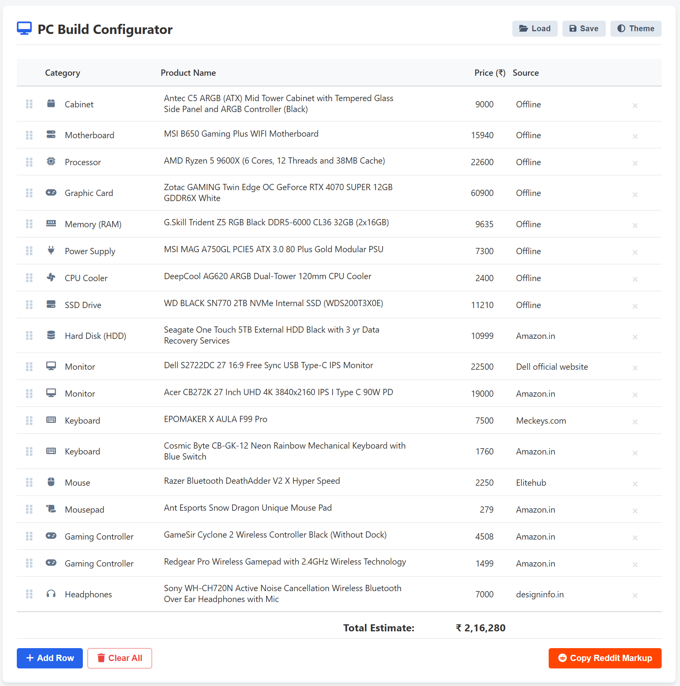

# 🖥️ PC Build Configurator

A simple, fast tool to plan your PC build and track prices. It creates clean tables that are ready to share on Reddit.

## 🚀 Features
* **Reddit Mode:** One-click copy for Reddit Markdown tables.
* **Drag & Drop:** Reorder parts easily by dragging the grip icon.
* **Save & Load:** Save your build as a `.json` file to edit later.
* **Dark Mode:** Easy on the eyes for those late-night build sessions.
* **Icons:** Automatic icons for CPU, GPU, RAM, etc.

## 📋 How to Use
1.  **Enter Parts:** Select a category, type the product name, and enter the price.
2.  **Organize:** Use the handle on the left to drag rows up or down.
3.  **Share:** Click "Copy Reddit Markup" and paste it into a Reddit post.
4.  **Save:** Use the "Save" button to download your build so you don't lose your progress.

## 💡 Pro Tip
If you place a file named `default_build.json` in the same folder, the tool will automatically load those parts every time you open it.